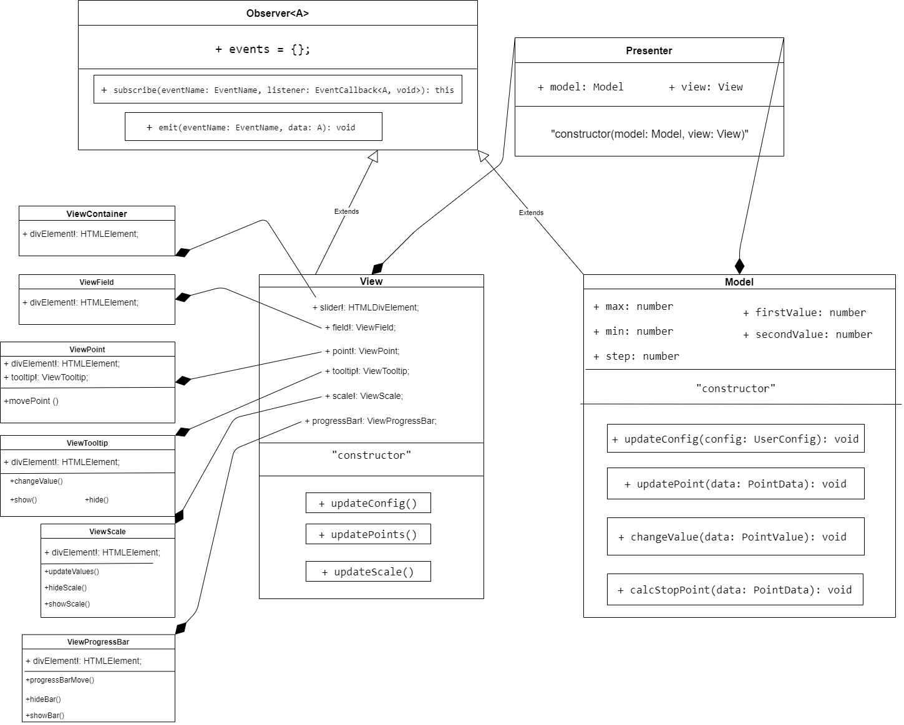

# Slider
Frontend-education-program with Webpack, Pug and Stylus, TypeScript-jQuery-Jasmine-Karma
[slider-demo-page](https://sprashivaite.github.io/slider/)

# How to use it

## Initialization
#### Clone repo
```commandline
git clone https://github.com/Sprashivaite/slider.git
```
#### Install dependencies
```commandline
npm install
```

#### Start dev server
```commandline
npm run dev
```

http://localhost:8080/ адрес локального сервера.

#### Start test
```commandline
npm run test
```

#### Start eslint
```commandline
npm run eslint
```

#### Production
```commandline
npm run prod
```

## Connect files

### HTML
Используемые файлы находятся в папке plugin-files. Подключить к странице index.js и style.css.
```javascript
<link rel="stylesheet" href="/plugin-files/style.css" />
<script src="./plugin-files/index.js"></script>
```

### CSS
В папке style.css можно изменить стили плагина. Элементы слайдер будут подстраиваться под ширину контейнера.

### JavaScript
После подключения файлов, плагин инициализируется на элементе при помощи  JQuery.
```javascript
$(selector).sliderPlugin();
```
По умолчанию контейнер для слайдера определяется путём поиска атрибута data-slider.
```javascript
<div data-slider></div>
```
# Basic configuration & option parameters

| Параметр          | Тип                | Значение по умолчанию | Описание                                                                                        |
|-------------------|--------------------|-----------------------|-------------------------------------------------------------------------------------------------|
| target            | HTMLDivElement           | поиск дата селектора  | Подключение к данному элементу                                                                  | 
| min               | number             | 0                     | Минимальное значение слайдера                                                                   |
| max               | number             | 100                   | Максимальное значение слайдера                                                                  |
| step              | number             | 1                     | Шаг                                                                                             |
| isHorizontal      | boolean            | true                  | Горизонтальный/Вертикальный                                                                     |
| isRange     | boolean            | true                  | Одиночный/Диапазон                                                                               |
| hasTooltip            | boolean            | true                  | Показывает/скрывает флажок                                                                      |
| hasScale           | boolean            | true                  | Показывает/скрывает шкалу                                                                       |
| scaleQuantity     | number             | 11                    | Количество делений шкалы                                                                        |

# Plugin methods
Также с помощью публичных методов можно управлять элементами слайдера. Чтобы получить доступ, нужно обратиться к .data("sliderPlugin"), далее вызывать методы.
```javascript 
let slider = $(selector).sliderPlugin().data("sliderPlugin");
```
### set value
```javascript
slider.setValue('firstPoint', number)
slider.setValue('secondPoint', number)
```
### set config
```javascript
slider.updateConfig(parameters)
```
### subscribe
```javascript
slider.subscribe('configChanged', data)  // Подписать на изменение конфигурации

const getFirstValue = (data) => data.firstValue // Подписать на изменение первого значения
slider.subscribe('updatePoint', getFirstValue)

const getSecondValue = (data) => data.secondValue // Подписать на изменение второго значения
slider.subscribe('updatePoint', getSecondValue)  

```
# Architecture
Всё приложение разделено на три слоя: Model, View, Presenter.
### Model 
Model содержит в себе бизнес-логику, которая вычисляет расположение бегунков, значения слайдера. Не имеет зависимости от других слоёв.
### View
View содержит логику, связанную с отображением, а также реагирует на взаимодействие пользователя с приложением. View разделён на subView, которые зависят от главного класса. Во View создаются экземпляры классов subView, и передаёт им собственные значения через параметр метода. Таким образом логика разделена на отдельные файлы, которые зависят от состояния View.
### Presenter
Presenter зависит от Model и View. Обновления данных происходит путём подписки View и Model.


