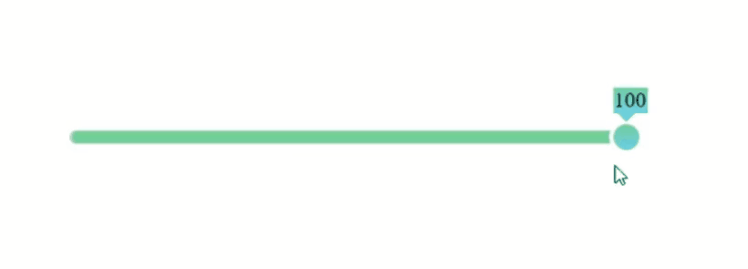

# Slider
TypeScript-jQuery-Jasmine-Karma
[slider-demo-page](https://sprashivaite.github.io/slider-demo-page/)

# How to use it

Используемые файлы находятся в папке dist. Подключить к странице index.js и style.css.

## HTML

```javascript
<link rel="stylesheet" href="/dist/style.css" />
<script src="./dist/index.js"></script>
```

## CSS
В папке style.css можно изменить стили плагина. Элементы слайдер будут подстраиваться под ширину контейнера.

# Initialization
После подключения файлов, плагин иницилизируется на элементе при помощи  JQuery.
```javascript
$(selector).sliderPlugin();
```
Также подключение возможно без использования JQuery, путём создания экземпляра класса AppSlider.
```javascript
const slider = new AppSlider({target: container})
```
## Initialize via HTML
По умолчанию контейнер для слайдера определяется путём поиска атрибута data-slider.
```javascript
<div data-slider></div>
```
Или элементу с классом ".slider".
```javascript
<div class="slider"></div>
```
# Basic configuration & option parameters
Дефолтные параметры указаны первым свойством обьекта.
```javascript
$(selector).sliderPlugin({
    target: null // поиск дата селектора
    target: $(".container") // подключение к данному элементу
});

$(selector).sliderPlugin({
    isHorizontal: true // горизонтальный
    isHorizontal: false // вертикальный
});

$(selector).sliderPlugin({
    max: 100 // максимальное значение
    max: 0.9 // дробное число
});

$(selector).sliderPlugin({
    min: 0 // минимальное значение
    min: -10 // также отрицательные числа
});

$(selector).sliderPlugin({
  step: 1 // шаг
  step: 0,1 // дробные значения шага
});

$(selector).sliderPlugin({
    isRangeSlider: true // range slider
    isRangeSlider: false // single slider
});

$(selector).sliderPlugin({
    isRangeSlider: true // range slider
    isRangeSlider: false // single slider
});

$(selector).sliderPlugin({
    isFlag: true // показать флажок 
    isFlag: false // скрыть флажок
});


$(selector).sliderPlugin({
    isScale: true // показать шкалу 
    isScale: false // скрыть шкалу
});

$(selector).sliderPlugin({
    scaleQuantity: 6 // количество числе шкалы
    scaleQuantity: 2 // количество числе шкалы
});
```
# Plugin methods
Также с помощью публичных методов можно управлять элементами слайдера. Чтобы получить доступ, нужно обратиться к .data("sliderPlugin"), далее вызывать методы.
```javascript 
let slider = $(selector).sliderPlugin().data("sliderPlugin");
```
### change slider type
```javascript 
slider.presenter.changeTypeSlider();
```
### change orientation slider
```javascript
slider.presenter.changeOrientation();
```
### show or hide flag
```javascript
slider.view.flag.showFlag()
slider.view.flag.hideFlag()
```
### set value
```javascript
slider.presenter.setButtonValue(number)
slider.presenter.setButtonValue_2(number)
```
# Architecture
Всё приложение разделено на три слоя: Model, View, Presenter.
### Model 
Model содержит в себе бизнес-логику, которая вычисляет расположение бегунков, значения слайдера. Не имеет зависимости от других слоёв.
### View
View содержит логику, связанную с отображением, а также реагирует на взаимодействие пользователя с приложением. View разделён на subView, которые зависят от главного класса. Во View создаются экземпляры классов subView, и передаёт им собственные значения через параметр метода. Таким образом логика разделена на отдельные файлы, которые зависят от состояния View.
### Presenter
Presenter зависит от Model и View, использует их методы. Обновления данных происходит путём получения уведомлений от View.

## File structure
#### `coverage`
`coverage` содержить визуальное отображение тестов.
`dist` итоговые файлы.
`src` файлы разработки.
```
slider
└─── coverage
|  |  Model.js
|  |  Model.html
|  |  ...
└─── dist
|  |  index.html
|  |  style.css
|  |  index.js
└─── src
|  └─── Model
|  |  |  Model.ts
|  |  |  IModelConfig.ts
|  └─── View
|  |  |  View.ts
|  |  └─── subView
|  |  |  | ...
|  └─── Presenter
|  |  | Presenter.ts 
|  └─── tests
|  |  | Model.test.ts
|  |  | ...
```


